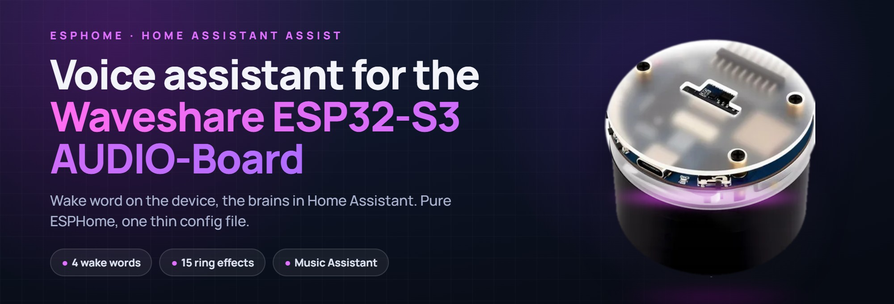
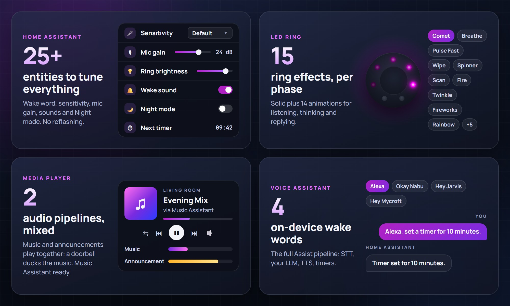

# ESPHome Voice Assistant for the Waveshare ESP32-S3-AUDIO-Board

A **Home Assistant voice satellite** running on the
[Waveshare ESP32-S3-AUDIO-Board](https://www.waveshare.com/esp32-s3-audio-board.htm),
the little AI smart-speaker devkit with a dual-mic array, an ES8311 codec, three
buttons and a 7-LED RGB ring. Pure ESPHome, no custom C firmware: an always-on
core you pull as a package, plus one thin config file you actually edit.

> [!TIP]
> ⭐ **Enjoying this project?** Every star is real motivation to keep it going.
>
> ☕ Want to say thanks another way? You can [buy me a coffee](https://buymeacoffee.com/zanula).

<!-- The badges live OUTSIDE the alert on purpose: Home Assistant rewrites a
GitHub alert into <ha-alert> and drops every child whose textContent is empty,
which silently removes any  placed inside it. -->

[](https://github.com/MichalZaniewicz/esphome-waveshare-esp32-s3-audio-va) [](https://buymeacoffee.com/zanula)

<div align="center">
  <video src="https://github.com/user-attachments/assets/0eae0230-de47-4f20-a6ea-47f65af35f86" controls width="400"></video>
</div>

> **Status: stable (v1.1.0).** Wake word, STT/TTS, clean playback and the LED
> ring are confirmed on-device. Full docs are in the
> [Wiki](https://github.com/MichalZaniewicz/esphome-waveshare-esp32-s3-audio-va/wiki);
> the release history is in [CHANGELOG.md](CHANGELOG.md).

```
You  ──▶  Waveshare ESP32-S3  ──▶  Home Assistant Assist
         (wake word + audio)      (STT / LLM / TTS)
```

## What it does



- **Voice assistant**: on-device wake word via `micro_wake_word` (Alexa, Okay
  Nabu, Hey Jarvis or Hey Mycroft, picked in Home Assistant), the full Home
  Assistant Assist pipeline (STT / LLM / TTS), a wake beep and music ducking
  while it listens.
- **Simultaneous music and announcements**: a mixer speaker blends the media and
  announcement pipelines, so a doorbell announcement ducks the music instead of
  fighting it. Both are exposed to Music Assistant.
- **LED ring**: one state machine drives it. Boot, no-Wi-Fi, no-HA, listening,
  thinking, replying, timer counting, ringing, volume changed - each a distinct
  colour/effect. Brightness and the animation for the listening / thinking /
  replying phases are pickable from HA: solid plus 14 animations - pulses,
  breathe, wipe, scan, spinner, comet, twinkle, fireworks, fire, rainbows.
- **Timers**: set by voice, with an on-ring countdown and a "Next timer" sensor
  in HA. (A daily-alarm engine is present but its entities are hidden by default.)
- **Buttons**: the three onboard keys do volume down, play-pause, volume up.
- **Boot chime**: a short "ready" sound once the device connects to HA
  (toggleable, and it also settles the amp so the ring boots silent).
- **Night mode**: one switch dims the ring to its own brightness and skips the
  wake beep and boot chime. Drive it from any Home Assistant automation.
- **Tunable live from HA**: the wake word, microphone mute, ES7210 mic gain, LED
  brightness and wake-word sensitivity are all entities, so there's no
  reflashing to tune it.

## Quick start

> Requires **ESPHome 2026.8.0+**.

1. Copy `secrets.example.yaml` to `secrets.yaml` and fill in your Wi-Fi. The
   native API is unencrypted by default; enable encryption in `base/core.yaml`
   if you want it (see the commented block there).
2. Copy **`waveshare-va.yaml`** next to it and edit the `substitutions:` at the
   top (device name, timezone, volume limits). That thin file is the only
   firmware file you keep. The core is **pulled from GitHub at compile time**,
   see its `packages:` block.
3. **First flash over USB**, then updates go wireless:
   ```
   esphome run waveshare-va.yaml
   ```
   Or drop both files into the ESPHome dashboard's `/config/esphome/` and hit
   Install.
4. In Home Assistant: the new ESPHome device appears, open **Configure** and
   assign an Assist pipeline.
5. Say "Alexa". The ring should go violet. To use another wake word, change
   **Wake word** on the device page (see [Wake words](#wake-words)).

The example config pins the `v1.1.0` release tag, so a build is reproducible. To
move to a newer release, bump `ref:` in the `packages:` block to a later tag (or
`main` to track the latest), then `esphome clean waveshare-va.yaml` (clears the
package cache) and `esphome run waveshare-va.yaml`.

## Documentation

The [Wiki](https://github.com/MichalZaniewicz/esphome-waveshare-esp32-s3-audio-va/wiki)
has the full guide:

- **[Installation](https://github.com/MichalZaniewicz/esphome-waveshare-esp32-s3-audio-va/wiki/Installation)**: first flash, Home Assistant setup, updating.
- **[Configuration](https://github.com/MichalZaniewicz/esphome-waveshare-esp32-s3-audio-va/wiki/Configuration)**: every substitution and every Home Assistant entity.
- **[Audio architecture](https://github.com/MichalZaniewicz/esphome-waveshare-esp32-s3-audio-va/wiki/Audio-architecture)**: the shared-I2S two-bus design, in depth.
- **[LED ring](https://github.com/MichalZaniewicz/esphome-waveshare-esp32-s3-audio-va/wiki/LED-ring)**: the state machine and every ring effect.
- **[Hardware](https://github.com/MichalZaniewicz/esphome-waveshare-esp32-s3-audio-va/wiki/Hardware)**: pinout, I2C map, and sourced gotchas.
- **[Troubleshooting](https://github.com/MichalZaniewicz/esphome-waveshare-esp32-s3-audio-va/wiki/Troubleshooting)** and **[FAQ](https://github.com/MichalZaniewicz/esphome-waveshare-esp32-s3-audio-va/wiki/FAQ)**.

## How the shared I2S bus is handled

The board wires the **ES8311 (DAC) and the ES7210 (ADC) to the same BCLK/LRCLK
pins**, and only one device can drive those clocks. ESPHome also cannot run a
single I2S bus full-duplex: a microphone and a speaker on one bus each try to
init the port, and the second fails with "Parent bus is busy".

The layout that works, all on **stock ESPHome components**:

- **Two I2S buses** (two ports) over the shared pins. The **mic bus is the I2S
  master**: it is always capturing for the wake word, so it drives BCLK/LRCLK/MCLK
  continuously. The **speaker bus is a slave** that reads the mic's clock, so it
  never needs a port of its own to master.
- The ES8311 and ES7210 are stock and slave to the mic's clock.
- The mic is pinned to **16-bit** (the i2s_audio default is 32-bit); since the
  mic is master it sets the frame's slot width, and a 32-bit frame against the
  16-bit DAC comes out as noise.

This gives simultaneous capture + playback with no custom component. The
annotated config is in the audio section of `base/core.yaml`.

## Repository layout

```
waveshare-va.yaml          # YOUR config: copy + edit this (pulls the rest from GitHub)
secrets.example.yaml       # copy to secrets.yaml
base/
  core.yaml                # the always-on core, pulled as a remote package
ci/
  build.yaml               # CI build target: compiles the core from the working tree
.github/workflows/
  build.yml                # compiles the firmware on every push and pull request
docs/
  HARDWARE.md              # pinout, I2C map, gotchas
scripts/
  validate.py              # offline YAML check (syntax, substitutions, duplicate ids)
  esplog.py                # stream device logs over the native API
skill/
  waveshare-esp32-s3-audio/  # Claude Code skill: pinout + hard-won gotchas
```

## Configuration

Everything worth changing day to day is a Home Assistant entity, not a config
edit: mic gain, LED brightness, the ring animation per assistant phase
(Listening / Thinking / Replying effect), the wake word and its sensitivity,
night mode, wake sound, boot sound, microphone mute.

What lives in `waveshare-va.yaml`:

| Substitution | Default | What it does |
|---|---|---|
| `name` / `friendly_name` | `waveshare-va` / `Waveshare Voice` | Device name. Changing `name` re-creates every entity in HA. |
| `posix_timezone` | `CET-1CEST,...` | Clock zone in POSIX form (the device has no IANA database). DST automatic. |
| `volume_min` / `volume_max` | `0.4` / `0.8` | Media player clamps, because the onboard amp distorts near the top. |
| `hidden_ssid` | `false` | `true` enables `fast_connect` for a hidden SSID. |
| `boot_sound_file` | repo `startup.mp3` | The connect-to-HA chime. Any URL or local MP3/FLAC/WAV. |

Pins and the audio format are substitutions too (in `base/core.yaml`), but you
should not need them unless you are porting to another board.

### Wake words

The firmware ships four wake word models: `alexa` (the default), `okay_nabu`,
`hey_jarvis` and `hey_mycroft`. Pick the active one with the **Wake
word** select on the device page in Home Assistant; the choice is stored on the
device and survives reboots and updates.

If several satellites share one Home Assistant instance and can hear the same
voice, give each a different wake word. Home Assistant ignores a wake word it
already heard within the last two seconds, on any device, so two satellites on
the same word cancel each other out (the second one beeps and does nothing).

### Night mode

The **Night mode** switch dims the ring to **Night LED Ring Brightness** and
skips the wake beep and the boot chime. Replies, timers and the alarm still
play at the normal volume. It is a plain switch, so any automation can drive it:

```yaml
automation:
  - alias: Voice satellite night mode
    triggers:
      - trigger: sun
        event: sunset
        id: "on"
      - trigger: sun
        event: sunrise
        id: "off"
    actions:
      - action: switch.turn_{{ trigger.id }}
        target:
          entity_id: switch.waveshare_va_night_mode
```

### Custom wake word models

Any of the four slots can be replaced with any microWakeWord v2 model by
extending it by `id` in your own config:

```yaml
micro_wake_word:
  models:
    - id: !extend alexa
      model: https://example.com/my_wake_word.json
      # probability_cutoff: 0.85   # optional, overrides the manifest default
```

The **Wake word sensitivity** presets are relative to each model's default
cutoff (its manifest value, or `probability_cutoff:` above): *Slightly
sensitive* uses the default, *Moderately* and *Very sensitive* lower it step by
step. For exact control, set the select to **Custom** and use the **Wake word 1
threshold** (the `alexa` slot) and **Wake word 2 threshold** (the `okay_nabu`
slot) sliders, from 0.50 to 0.99. Lower values trigger more easily and give more
false activations. On first boot both sliders start at their model's default
cutoff. `hey_jarvis` and `hey_mycroft` have no slider; in **Custom** they keep
their default cutoff.

## Claude Code skill

This repo ships a [Claude Code](https://claude.com/claude-code) skill at
[`skill/waveshare-esp32-s3-audio/`](skill/waveshare-esp32-s3-audio/SKILL.md):
the pinout, the shared-I2S constraint, and the gotchas that cost real debugging
time. Install it user-wide so any session picks it up:

```bash
cp -r skill/waveshare-esp32-s3-audio ~/.claude/skills/
```

## Credits

- **[jensenbox](https://github.com/jensenbox/waveshare-esp32-s3-audio)**: the
  ESP-master I2S layout for this board that the audio setup is based on.
- **ESPHome**: everything the firmware is built out of.
- **[Home Assistant Voice PE](https://github.com/esphome/home-assistant-voice-pe)**:
  the sounds, and the phase/ducking model the LED state machine follows.
